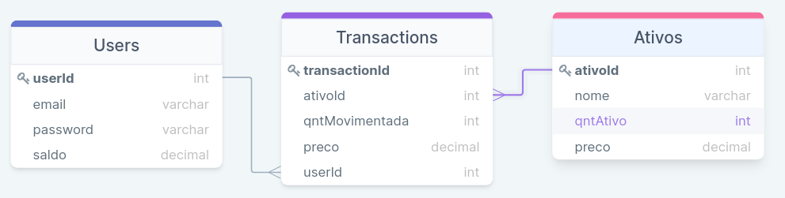
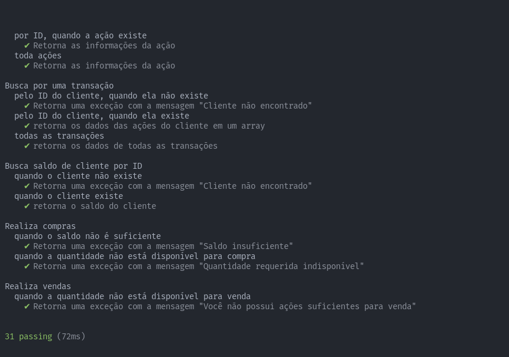
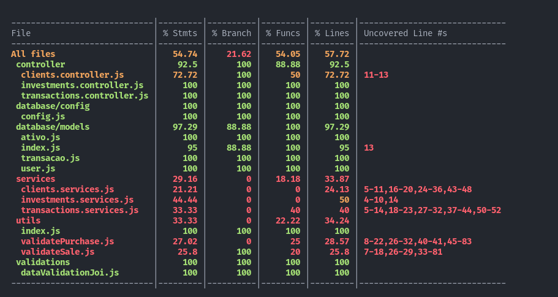
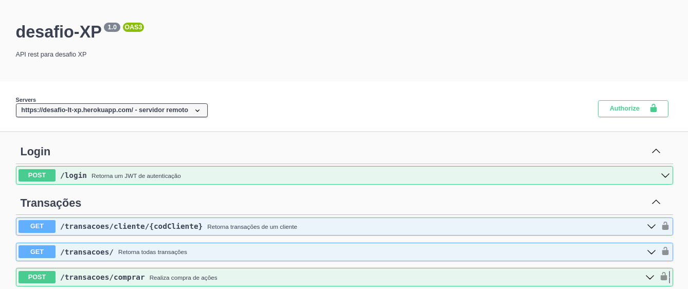

# Bem vindo(a) ao repositório do projeto para o Desafio-XP!

Este projeto é parte do processo seletivo para desenvolvedor júnior na XP.inc.
O desafio consiste na criação de uma API-RESTful conectada à um Banco de dados que retorne informações relacionadas à compra e venda de ativos financeiros.

## Quais ações são esperadas ?

* **Login** - Autenticação com email e senha do cliente.
* **Cadastro** - Criação de um novo cliente no sistema.
* **Transações** - Listar as transações. Sejam elas filtradas por cliente ou todas as transações registradas.
* **Compra e venda** - Realizar transações de compra e venda de ativos financeiros.
* **Depósito e saque** - Realizar transações de depósito e saque em suas contas.
* **Investimentos** - Listar os investimentos. Sejam elas filtradas por ativo ou todas os investimentos registrados.
* **Consulta** - Consultar o saldo da conta do cliente.

## Índice
### Stack utilizada

**Desenvolvimento:** Javascript, Node.js, express, Sequelize, JOI, JWT, MySQL, Postgres* e Swagger. 

**Testes:** Mocha, Chai e Sinon.

## Arquitetura de Software

Uma ótima definição dada por Martin Fowler para arquitetura de software foi é que *arquitetura é um conhecimento compartilhado por desenvolvedores experientes sobre como organizar um sistema de software.*

Para o desenvolvimento e melhor organização da aplicação, o código foi desenvolvido utilizando-se de 3 camadas: **Model, Services e Controllers (MSC).**

Na *model*, é feito a manipulação e definição da estrutura dos dados. Todo acesso ao banco de dados é feito por essa camada. 

Na *services*, todas as regras de negócio são desenvolvidas e aplicadas.

Na *controller*, é recebido a requisição do cliente e são feitas as validações dos dados recebidos.

## Estrutura de dados

Para estruturar um banco de dados que suportasse todas as requisições dos contratos, foi desenvolvido um banco de dados com o diagrama entidade-relacionamento acima.

Nele possuímos duas tabelas que possuem um relacionamento do tipo N:N (usuários e ativos), mediados por uma tabela intermediária que guarda as informações sobre as transações.

## Decisões e escolhas

A primeira grande escolha a ser feita ao me deparar com o desafio foi a linguagem a ser utilizada. Para essa decisão, o fator que mais pesou foi minha maior experiência com a linguagem Javascript no desenvolvimento de API's que utilizam uma arquitetura MSC.

No meu entendimento, devido à baixa complexidade do banco de dados, com apenas duas tabelas, me debruçar numa linguagem orientada a objetos como Typescript seria um esforço desnecessário, dado o curto período de tempo para entrega e minha menor experiência nessa linguagem. Dessa forma, optei por seguir com o paradigma funcional do javascript, mantendo uma boa organização de código que, aliados a testes unitários, me garantisse uma linguagem fracamente tipada fosse suficiente para atacar o problema.

A segunda decisão foi qual seria a estrutura do banco de dados e como eu faria acesso à ele. A fim de minimizar a complexidade de *query* de consulta ao banco de dados e flexibilidade no desenvolvimento, escolhi utilizar o ORM com a biblioteca Sequelize. Essa escolha me permitiu atacar o problema com uma abordagem intermediária entre *code first* e *model first*, onde pude trabalhar com uma espécie de "banco de dados vivo", onde utilizando código javascript para abstrair a complexidade do banco, conseguia avançar com o projeto sem muitas preocupações com a estrutura do banco de dados.

A terceira decisão foi sobre a privacidade dos dados. No desenvolvimento, utilizei JWT(*jsonwebtoken*) para autenticação dos usuários e bcrypt para criptografar as senhas no banco de dados, devido à sensibilidade dos dados.

Por fim, para manter a qualidade de código, utilizei conhecimentos adquiridos na leitura do livro *Clean Code* a fim de garantir que meu projeto seguisse três parâmetros: Manutenibilidade, baixa complexidade e reusabilidade.
A manutenibilidade foi garantida pela escrita de testes unitários para todas as funções das rotas previstas nos contratos. A baixa complexidade consegui atingir ao utilizar uma arquitetura em camadas, que define um escopo único para as camadas. E a reusabilidade me foi garantida pelo paradigma funcional.

## Próximos passos
Alguns pontos não puderam ser atacados por conta do limite de tempo para o desenvolvimento do projeto. Irei dividir em categorias de prioridade quais passos eu pretendo dar para o melhor funcionamento da API.

#### Extremamente necessários 

* Aumentar a cobertura de testes unitários da aplicação, incluindo testes para os middlewares e funções de utilidades.
* Testes de integração que garantam que o funcionamento e fluxo de informação entre as camadas estejam funcionando corretamente.
* Implementação de um sistema de autorização, onde as requisições à API se limitariam às informações do usuário logado.

#### Necessários

* Adicionar ao cadastro dos usuários sua atribuição (cliente, funcionário, admin) e, com base na *role* do usuário logado, limitasse acesso a alguns endpoints.

#### Para meu aprendizado/desenvolvimento

* Refatorar o código utilizando typescript e conceitos de SOLID.
* Alterar o lançamentos de exceções utilizado por um padrão de notificações que seja menos agressivas ao sistema.**

** Leitura interessantes: [Não lance Exceptions em seu Domínio… Use Notifications!](https://medium.com/tableless/n%C3%A3o-lance-exceptions-em-seu-dom%C3%ADnio-use-notifications-70b31f7148d3), [Notification Pattern – Estão te vendendo um conceito errado](https://gago.io/blog/2019-04-28-notification-pattern/)

## Deploy

Foi feito o deploy da aplicação dockerizada no Heroku.

A documentação da aplicação esta no ar no seguinte link: https://desafio-lt-xp.herokuapp.com/api-docs/

O banco de dados está hospedado no https://supabase.com/

*Um ponto importante de ressaltar é que, devido à dificuldade que encontrei de conectar um banco MySQL ao Heroku, decidi me desafiar e, utilizando a versatilidade que o Sequelize me dispõe, fiz o deploy de uma branch à frente da main, [lt-deploy-postgres](https://github.com/leonardo-terra/desafio-xp/tree/lt-deploy-postgres) que utiliza um banco de dados postgres para o deploy.
NOTA: O comportamento da aplicação é o mesmo. Vide documentação.

## Testes

Foram desenvolvidos testes unitários que envolvem todas as funções relacionadas às chamadas dos contratos.
Ao final da aplicação, 31 testes unitários foram desenvolvidos e, conforme comentado na seção de próximos passos, é de extrema importância que se aumente a cobertura de testes.

Para rodar os testes, utilize o comando:

~~~bash
npm run test
~~~

Para rodar a cobertura de testes, utilize o comando:
~~~bash
npm run test:coverage
~~~

## Instalação
### Rodando localmente

OBS: É preciso que você tenha o node e Mysql instalados localmente para rodar dessa forma!

1. Faça o download do projeto para a sua máquina ou clone o repositório com o comando:
~~~bash
git clone git@github.com:leonardo-terra/desafio-xp.git
~~~
2. Entre na pasta do repositório que acabou de clonar.
~~~bash
cd desafio-xp
~~~
3. Instale as dependências
~~~bash
npm install
~~~
4. Utilize o comando reset para construir o banco de dados de testes
~~~bash
npm run reset
~~~
5. Execute a aplicação
~~~bash
npm run dev
~~~

### Rodando com docker
obs: É necessário ter o docker instalado localmente na sua máquina.

1. Faça o download do projeto para a sua máquina ou clone o repositório com o comando:
~~~bash
git clone git@github.com:leonardo-terra/desafio-xp.git
~~~
2. Entre na pasta do repositório que acabou de clonar.
~~~bash
cd desafio-xp
~~~
3. Rode o comando para buildar o container
~~~bash
docker-compose up -d
~~~
4. Inicie a linha de comando no container criado
~~~bash
 docker exec -it desafio-xp bash
~~~
5. No terminal do docker, instale as dependências do projeto
~~~bash
npm install
~~~
6. Inicie o projeto no container
~~~bash
npm start
~~~

## Variáveis de ambiente
As variáveis de ambiente do projeto estão setadas no arquivo .*env* . Ao realizar o download do projeto, você verá na pasta raiz do projeto um arquivo *.envexample*

As seguintes variáveis precisam ser configuradas para rodar o projeto localmente:

~~~bash
NODE_ENV= > ambiente em que a aplicação rodará
PORT= > porta onde o servidor ira subir a aplicação

MYSQL_HOST= > host em que a aplicação se hospedará
MYSQL_PORT= > porta de coneção com o banco de dados
MYSQL_DB_NAME= > nome do banco de dados
MYSQL_USER= > usuário do mysql
MYSQL_PASSWORD= > senha do mysql

JWT_SECRET= > senha para autenticação do JWT.
~~~

Sugestão de configuração

~~~bash
NODE_ENV=development
PORT=3001

MYSQL_HOST=localhost
MYSQL_PORT=3306
MYSQL_DB_NAME=desafio-xp
MYSQL_USER=root
MYSQL_PASSWORD=password

JWT_SECRET=secretJWT
~~~

## Documentação

Foi utilizada o padrão OpenAPI para documentar as rotas da API. Por intermédio do swagger, todas as rotas foram listadas e podem ser visualizadas [neste link](https://desafio-lt-xp.herokuapp.com/api-docs/).
Obs: Lembre-se de alterar para o servidor remoto!

Para testar as rotas autenticáveis, é preciso estar logado. 
Para obter acesso, você pode criar um novo cliente na rota POST: /cliente.

## Autor

[Leonardo Terra](https://www.linkedin.com/in/leonardo-terra/) - Estudante de desenvolvedor web full-stack pela Trybe e graduando em Engenharia química na UFRJ.

## Agradecimentos

Deixo registrado meu profundo e verdadeiro obrigado primeiramente aos meus pais e irmão pelo apoio incondicional ao meu sonho. À minha namorada, pela total compreensão nas horas que eu estive ausente estudando, pelo apoio, carinho e amor que me oferece, e à XP/Trybe pela oportunidade de estudo e desenvolvimento pessoal e profissional. 
